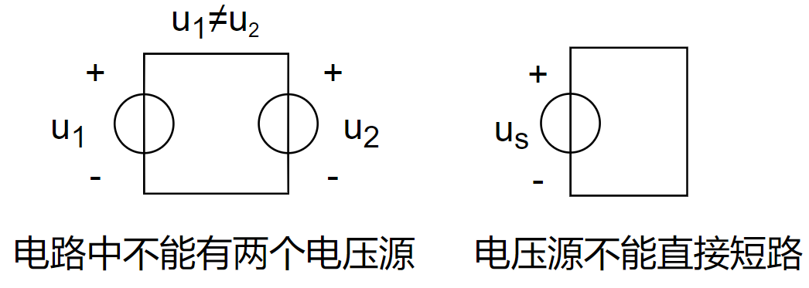
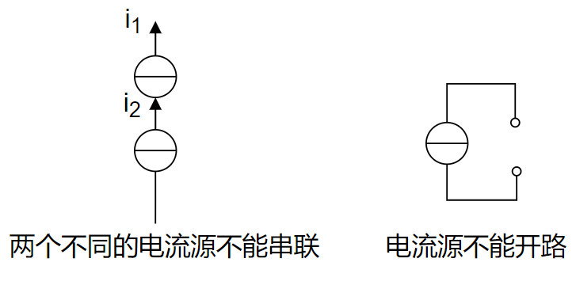

# 第一章	电路模拟和电路定律

## 1.1	电路和电路模拟

1. **实际电路：**由电工设备和电气器件按预期目的连接构成的电流的通路

2. **实际电路的功能：**能量的传输、分配与转换；信息的传递、控制与处理

3. **实际电路的共性：**建立在同一电路理论基础上

4. **电源：**电能或电信号的发生器成为电源

5. **负载：**用电设备成为负载

6. **激励源：**由于电路中的电压、电流是在电源的作用下产生的，因此电源又称为激励源或激励

7. **响应：**由激励而在电路中产生的电压、电流称为响应

8. **输入和输出：**根据激励与响应之间的因果关系，把激励称为输入，响应称为输出

9. **电路模型：**反映实际电路部件的主要电磁性质的理想电路元件及其组合

10. **理想电路元件：**有某种确定的电磁性能的理想元件

11. 5种基本的理想电路元件：

    - **电阻元件：**表示消耗电能的元件

    - **电感元件：**表示产生磁场，储存磁场能量的元件

    - **电容元件：**表示产生电场，存储电场能量的元件

    - **电压源和电流源：**表示将其它形式的能量转变成电能的元件

      > [!CAUTION]
      >
      > 注意：5种基本理想电路元件有三个特征：
      >
      > - 只有两个端子
      > - 可以用电压或电流按数学方式描述
      > - 不能被分解为其他元件

12. 实际电路的两个特征：

    - 具有相同的主要电磁性能的实际电路部件，在一定条件下可用同一电路模型表示
    - 同一实际电路部件在不同的应用条件下，其电路模型可以有不同的形式

## 1.2	电流和电压的参考方向

### 电流的参考方向

1. **电流：**带电粒子有规则的定向运动

2. **电流强度：**单位时间内通过导体横截面的电荷量（$\boxed{i(t)\stackrel{\mathrm{def}}{=}\lim\limits_{\Delta t\rightarrow 0}\frac{\Delta q}{\Delta t}=\frac{dq}{dt}}$）

3. **单位：**A(安培)、kA、mA、μA（$1kA=10^3A$、$1mA=10^{-3}A$、$1\mu A=10^{-6}A$）

4. **方向：**规定正电荷的运动方向为电流的实际方向

5. 元件（导线）中电流流动的实际方向只有两种可能：

   

6. **参考方向：**任意假定一个正电荷运动的方向即为电流的参考方向

   

7. 电流的参考方向与实际方向的关系：

   

8. 电流参考方向的两种表示：

   - 用箭头表示：箭头的指向为电流的参考方向（推荐）

     

   - 用双下标表示：如$i_{AB}$​，电流的参考方向由A指向B（不推荐）

     

### 电压的参考方向

1. **电位$\varphi$：**单位正电荷$q$从电路中一点移至参考点（$\varphi=0$）时电场力做功的大小。

2. **电压U：**单位正电荷$q$从电路中一点移至另一点时电场力做功（$W$）的大小（$\boxed{U\stackrel{\mathrm{def}}{=}\frac{dW}{dq}}$）

3. **实际电压方向：**电位真正降低的方向

4. **单位：**V(伏)、kV、mV、μV

5. **电压(降)的参考方向：**假设高电位指向低电位的方向

   

6. 电压参考方向的三种表示方式：

   - 用箭头表示：（不推荐）

     

   - 用正负极性表示：（推荐）

     

   - 用双下标表示：（不推荐）

     

### 关联参考方向

1. **关联参考方向：**元件或支路的$u,i$采用相同的参考方向称之为关联参考方向。反之，称之为非关联参考方向。

   

2. > [!CAUTION]
   >
   > 注意事项：
   >
   > - 分析电路前必须选定电压和电流的参考方向
   > - 参考方向一经选定，必须在图中相应位置标注（包括方向和符号），在计算过程中不得任意改变
   > - 参考方向不同时，其表达式相差一负号，但电压、电流的实际方向不变。

## 1.3	电功率和能量

1. **电功率：**单位时间内电场力所做的功

   $p=\frac{dw}{dt}$	$u=\frac{dw}{dq}$	$i=\frac{dq}{dt}$​
   $$
   p=\frac{dw}{dt}=\frac{dw}{dq}\frac{dq}{dt}=ui
   $$
   **功率的单位：W（瓦）（Watt，瓦特）**

   **能量的单位：J（焦）（Joule，焦耳）**

2. 电路吸收或发出功率的判断

   <table>
       <tr>
           <td></td>
           <td>
               
吸收

           </td>
           <td>
               
发出

           </td>
           <td>
               
关联参考方向

           </td>
           <td>
               
非关联参考方向

           </td>
       </tr>
       <tr>
           <td>
               
符号

           </td>
           <td>
               
+

           </td>
           <td>
               
-

           </td>
           <td>
               
+

           </td>
           <td>
               
-

           </td>
       </tr>
   </table>
   
   
   
   
   
   
   > [!CAUTION]
   >
   > 注意:
   >
   > 对一完整的电路，满足：发出的功率＝吸收的功率

## 1.4	电路元件

1. **电路元件：**是电路中最基本的组成单元

2. 5种基本的理想电路元件：

   - **电阻元件：**表示消耗电能的元件

   - **电感元件：**表示产生磁场，储存磁场能量的元件

   - **电容元件：**表示产生电场，存储电场能量的元件

   - **电压源和电流源：**表示将其它形式的能量转变成电能的元件

     > [!CAUTION]
     >
     > 注意：如果表征元件端子特性的数学关系式是线性关系，该元件称为线性元件，否则称为非线性元件。

3. **端子特性（元件特性）：**元件的两个端子的电路物理量之间的代数函数关系称为元件的端子特性（亦称元件特性）

4. **集总（参数）元件：**假定，在任何时刻，流入二端元件的一个端子的电流等于从另一端子流出的电流，且两个端子之间的电压位单值量。

5. **集总电路：**由集总元件构成的电路称为集总电路，或称具有集总参数的电路

## 1.5	电阻元件

1. **电阻元件：**对电流呈现阻力的元件。其特性可用$u\thicksim i$平面上的一条曲线来描述：

   

2. **线性时不变电阻元件：**任何时刻端电压与电流成正比的电阻元件

   

3. $u\thicksim i$关系：满足欧姆定律

   

   

   > [!CAUTION]
   >
   > 注意欧姆定律：
   >
   > - 只适用于线性电阻（R为常数）
   > - 如电阻上的电压与电流参考方向非关联，公式中应冠以负号
   > - 说明线性电阻是无记忆、双向性的元件。

   

4. **功率**

   **电阻元件的关联参考方向功率计算**

   

   > [!NOTE]
   >
   > 上述电阻元件的电流、电压为关键参考方向，及$p=+ui$，假设该电阻功率为吸收功率，及$p=++ui$，因此改电阻元件可以表述为电阻元件吸收$p=ui$功率。

   **电阻元件的非关联参考方向功率计算**

   

   ****

   > [!NOTE]
   >
   > 上述电阻元件的电流、电压为非关键参考方向，及$p=-ui$，假设该电阻功率为发出功率，及$p=--ui$，因此该电阻元件可以表述为电阻元件发出$p=ui$功率。$u=-Ri$是由于$u\sim i$为非关键参考方向，最后取值为负，及表明了电阻元件发出了$p=-i^{2}R=-\frac{u^2}{R}$功率，等价为改电阻元件吸收了$p=i^{2}R=\frac{u^2}{R}$功率

   > [!IMPORTANT]
   >
   > 表明：电阻元件在任何时刻总是消耗功率的

   

5. **能量：**

   电阻元件从$t_0$到$t$的时间内吸收的电能为：
   $$
   W=\int_{t_0}^{t}Ri^2(\xi)d\xi
   $$

6. **开路：**当一个线性电阻元件的端电压不论为何值时，流过它的电流恒为零值，就把它称为开路。

   开路的伏安特性曲线在$u\sim i$平面上与电压轴重合，它相当于$R=\infty$或$G=0$。

   

   > [!CAUTION]
   >
   > 开路电流一定等于0（$i=0$），而电压不一定等于零

   

7. **短路：**当流过一个线性电阻元件的电流不论为何值时，它的端电压恒为零值，就把它称为短路。

   短路的伏安特性曲线在$u\sim i$平面上与电流轴重合，它相当于$R=0$或$G=\infty$

   

   > [!CAUTION]
   >
   > 短路电压一定等于0（$u=0$），而电流不一定等于零

## 1.6	电压源和电流源

### 理性电压源

1. **理想电压源：**其两端电压总能保持定值或一定的时间函数，其值与流过它的电流$~i~$​无关的元件叫理想电压源。

   

2. **理想电压源的电压、电流关系：**

   - 电源两端电压由电源本身决定，与外电路无关；与流经它的电流方向、大小无关。

   - 通过电压源的电流由电源及外电路共同决定。

     

     > [!NOTE]
     >
     > 电压源外接电阻，电流$~i=\frac{u_s}{R}$​
     >
     > 电压源开路，$~i=0~(R=\infty)$​
     >
     > 电压源短路，$~i=\infty~(R=0)$

3. **电压源的功率：**$P=u_s i$​

   - **电压、电流参考方向非关联：**

     

     物理意义：电流(正电荷)由低电位向高电位移动，外力克服电场力做功，电源发出功率。

     $P=u_si\Longrightarrow发出功率，起电源作用$​

     > [!NOTE]
     >
     > 电压源的电压、电流为非关联参考方向，因此$P=-u_si$，为了公式好看假设电压源为发出功率，即$P=--u_si$，最终有$P=u_si>0$，因此电压源为发出功率，起电源作用。

   - **电压、电流参考方向关联：**

     

     物理意义：电场力做功，电源吸收功率

     $P=u_si\Longrightarrow吸收功率，充当负载$

     > [!NOTE]
     >
     > 电压源的电压、电流为关联参考方向，因此$P=+u_si$，为了公式好看假设电压源为吸收功率，即$P=++u_si$，最终有$P=u_si>0$，因此电压源为吸收功率，起负载作用。

   - 例子：计算图示电路各元件的功率：

     
     $$
     解:	u_R=(10-5)=5V~~~~~~~~~~~~~~~~~\\
     i=\frac{u_R}{R}=\frac{5}{5}=1A~~~~~~~~~~~~\\~~~~~~~~~~~~~~
     P_{10V}=u_si=10\times 1=10W~~~~发出\\
     ~~~~~~~~~
     P_{5V}=u_si=5\times 1=5W~~~~吸收\\
     ~~~~~~~~~
     P_{R}=Ri^2=10\times 1=5W~~~~吸收\\
     满足:P(发)=P(吸)\\
     or~\sum P(发)=0~~\\
     or~\sum P(吸)=0~~
     $$

     > [!TIP]
     >
     > 电阻元件为关联参考方向
     >
     > 5V电压源为关联参考方向
     >
     > 10V电压源为非关联参考方向

### 理想电流源

1. **理想电流源：**其输出电流总能保持定值或一定的时间函数，其值与它的两端电压$~u~$无关的元件叫理想电流源。

   

2. **理想电流源的电压、电流关系**

   - 电流源的输出电流由电流本身决定，与外电路无关；与它的两端电压方向、大小无关

   - 电流源两端的电压由电源及外电路共同决定。

     

     > [!NOTE]
     >
     > 电流源外接电阻，电流$~u=Ri_s$​
     >
     > 电流源开路，$~u=0~(R=0)$​
     >
     > 电流源短路，$~u=\infty~(R=\infty)$

3. 实际电流源的产生：可由稳流电子设备产生，如晶体管的集电极电流与负载无关；光电池在一定光线照射下光电子被激发产生一定值的电流等。

4. **电流源的功率：**$P=ui_s$​​*

   1. - 电压、电流的参考方向非关联

        

        $P=ui_s\Longrightarrow 发出功率，起电源作用$​

        > [!NOTE]
        >
        > 电流源的电压、电流为非关联参考方向，因此$P=-u_si$，为了公式好看假设电流源为发出功率，即$P=--u_si$，最终有$P=u_si>0$，因此电流源为发出功率，起电源作用。

      - 电压、电流的参考方向关联

        

        $P=ui_s\Longrightarrow 吸收功率，充当负载$​

        > [!NOTE]
        >
        > 电流源的电压、电流为关联参考方向，因此$P=+u_si$，为了公式好看假设电压源为吸收功率，即$P=++u_si$，最终有$P=u_si>0$，因此电流源为吸收功率，起负载作用。

      - 例：计算图示电路各元件的功率

        
        $$
        解:i=-i_s=-2A~~~~~~~~~~~~~~~~~~~~~~~~~~~~~~~~~~~~~~~\\
        u=5V~~~~~~~~~~~~~~~~~~~~~~~~~~~~~~~~~~~~~~~~~~~~~~~~\\
        P_{2A}=i_su=2\times5=10W~~~~~~~~~~~~~~~~~发出\\
        P_{5V}=u_si=5\times(-2)=-10W~~~~~~~~发出\\
        满足:P(发)=P(吸)~~~~~~~~~~~~~~~~~~~~~~~\\
        or~\sum P(发)=0~~~~~~~~~~~~~~~~~~~~~~~~~\\
        or~\sum P(吸)=0~~~~~~~~~~~~~~~~~~~~~~~~~
        $$

        > > [!TIP]
        > >
        > > 假定电路中的电流方向为顺时间，电流源的方向为逆时针。因此求得电路中的电流为$i=-i_s$​，电路中的电压为5V
        > >
        > > 2A电流源为非关联参考方向
        > >
        > > 5V电压源为非关联参考方向

## 1.7	受控电源（非独立源）

1. **独立电源：**独立电源是电路中的“输入”，它表示外界对电路的作用，电路中电压或电流是由于独立电源起的“激励”作用产生的。

2. **受控电源：**电压或电流的大小和方向不是给定的时间函数，而是受电路中某个地方的电压（或电流）控制的电源，称受控源。

   

3. **受控电压源的分类：**根据控制量和被控制量是电压$~u~$或电流$~i~$，受控源可分四种类型：当被控制量是电压时，用受控电压源表示；当被控制量是电流时，用受控电流源表示。即有电流控制的电流源（CCCS）、电压控制的电流源（VCCS）、电压控制的电压源（VCVS）和电流控制的电压源（CCVS）。

   > [!TIP]
   >
   > 电压控制的电压源(VCVS)：Voltage Controlled Voltage Source
   >
   > 电压控制的电流源(VCCS)：Voltage Controlled Current Source
   >
   > 电流控制的电压源(CCVS)：Current Controlled Voltage Source
   >
   > 电流控制的电流源(CCCS)：Current Controlled Current  Source

   - 电流控制的电流源（CCCS）

     

     > [!NOTE]
     >
     > 上图把受控源表示为具有4个端子的电路模型，其中受控电压源或受控电流源具有一对端子，另一对控制端子则或为开路，或为短路（电阻部分），分别对应于控制量是开路电压或短路电流

   - 电压控制的电流（VCCS）

     

   - 电压控制的电压源（VCVS）

     

   - 电流控制的电压源（CCVS）

     

4. **受控源与独立源的比较**

   - 独立源电压（或电流）由电源本身决定，与电路中其它电压、电流无关，而受控源电压（或电流）由控制量决定

   - 独立源在电路中起“激励”作用，在电路中产生电压、电流，而受控源时反映电路中某处的电压或电流对另一处的电压或电流的控制关系，在电路中不能作为“激励”

   - 例：求电压$u_2$

     

     

5. **电压源和电流源的比较**

   |                                                            |                            电压源                            |                            电流源                            |
   | :--------------------------------------------------------: | :----------------------------------------------------------: | :----------------------------------------------------------: |
   |                            定义                            | 其两端电压总能保持定值或一定的时间函数，其值与流过它的电流 i 无关的元件叫理想电压源。 | 其输出电流总能保持定值或一定的时间函数，其值与它的两端电压 u 无关的元件叫理想电流源 |
   |                          图形符号                          |  |  |
   |                         UI特性曲线                         |  |  |
   |                  UI特性曲线对应的等效阻值                  |                         $u_{useq}=0$                         |                       $u_{is}=\infty$                        |
   | 简单电路中等效电阻(阻值≤0的电阻不存在，但阻值≤0的东西存在) |  |  |
   |                           受控源                           |  |  |
   |                            禁止                            |  |  |

   > [!WARNING]
   >
   > 在电路中，理想电源的阻值是什么与理想电源的$~u_i~$特性的阻值无关

## 1.8	基尔霍夫定律

1. **基尔霍夫定律：**基尔霍夫定律包括基尔霍夫电流定律（KCL）和基尔霍夫电压定律（KVL）。它反映了电路中所有支路电压和电流所遵循的基本规律，是分析集总参数电路的基本定律。基尔霍夫定律与元件特性构成了电路分析的基础。

2. **支路**

   

   - 电路中每一个两端元件就叫一条支路

   - 电路中通过同一电流的分支

     > [!NOTE]
     >
     > 支路的定义方式有两种，如上所述。
     >
     > 对于第一种定义：电路中每一个两端元件就叫一条支路。上图由5个两端元件，因此对于第一种第一支路一共有5个
     >
     > 对于第二种定义：电路中通过同一电流的分支。上图$~u_{S1}~R_1~$为一条支路，$u_{S2}~R_2~$为一条支路，$R_3~$​为一条支路，因此第二种定义支路一共有3个
     >
     > 推荐掌握第二种支路的定义方法，即电路中通过同一电流的分支。

3. **结点：**

   

   - 元件的连接点称为结点

   - 三条以上的支路的连接点称为结点

     > [!NOTE]
     >
     > 结点的定义方式有两种，如上所述。
     >
     > 对于第一种定义：元件的连接点称为结点。上图$u_{S1}~R_1~$之间有一个连接点，$u_{S1}~u_{S2}~R_3~$之间有一个连接点，$u_{S2}~R_2~$之间有一个连接点，$R_1~R_2~R_3~$之间有一个连接点，因此总共有4个结点
     >
     > 对于第二种定义：三条以上的支路的连接点称为结点。上图$~u_{S1}~u_{S2}~R_3~$为一个连接点，$~R_1~R_2~R_3~$为一个连接点，因此总共有2个结点。
     >
     > 推荐掌握第二种结点的定义，即三条以上的支路的连接点称为结点

4. **路径：**两结点间的一条通路。由支路构成

5. **回路：**由支路组成的闭合路径

   

   > [!NOTE]
   >
   > 上图$u_{S1}~R_1~R_2~u_{S2}~$为一个闭合路径，$u_{S2}~R_2~R_3~$为一个闭合路径，$u_{S1}~R_1~R_3~$为一个闭合路径，因此总共有3个回路

6. **网孔：**对平面电路，其内部不含任何支路的回路称网孔

   

   > [!NOTE]
   >
   > 上图$u_{S1}~R_1~R_2~u_{S2}~$为一个回路内部不含任何回路，因此为一个网孔，$u_{S2}~R_2~R_3~$为一个回路内部不含任何回路，因此为一个网孔，而$~u_{S1}~R_1~R_3~$为一个回路，但因其内部含有$u_{S1}~R_1~R_2~u_{S2}~$和$u_{S2}~R_2~R_3~$，因此不为网孔，因此总共有2个网孔

   > [!IMPORTANT]
   >
   > 网孔是回路，但回路不一定是网孔

7. **基尔霍夫电流定律（KCL：Kirchhoff's Current Law）：**在集总参数电路中，任意时刻，对任意结点流出（或流入）该结点电流的代数和等于零（流出结点的电流前面取“+”号，则流入结点的电流前面取“-”号）
   $$
   \sum_{b=1}^m i(t)=0~or~\sum i_入=\sum i_出\Longrightarrow 流进的电流等于流出的电流
   $$
   例：

   
   $$
   令流出电流为'+',有:\\
   -i_1-i_2+i_3+i_4+i_5=0\\
   or~~~~~~~i_1+i_2=i_3+i_4+i_5
   $$
   例：

   
   $$
   i_1+i_4+i_6=0\\
   -i_2-i_4+i_5=0~~\\
   ~i_3-i_5-i_6=0\\
   三式相加得:~~~~~~~~~~~\\
   ~i_1-i_2+i_3=0
   $$

   > [!IMPORTANT]
   >
   > KCL可推广应用于电路中包围多个结点得任意闭合面

   > [!CAUTION]
   >
   > 1. KCL是电荷守恒和电流连续性原理在电路中任意结点处的反映
   > 2. KCL是对结点处支路电流加的约束，与支路上接的是什么元件无关，与电路时线性还是非线性无关
   > 3. KCL方程是按电流参考方向列写的，与电流实际方向无关

8. **基尔霍夫电压定律（KVL：Kirchhoff's Voltage Law）：**在集总参数电路中，任一时刻，沿任一回路，所有支路电压的代数和恒等于零。
   $$
   \sum_{b=1}^m u(t)=0~~or~~\sum u_降 = \sum u_升
   $$

   > [!NOTE]
   >
   > 1. 标定各元件电压参考方向
   > 2. 选定回路绕行方向，顺时针或逆时针

   
   $$
   选取顺时针为回路的绕行方向\\
   -U_1-U_{S1}+U_2+U_3+U_4+U_{S4}=0\\
   Or~~~~~~~~~~~~~~~~~~~~~~~~~~~~~~~~~~~~~~~~~~~~~~~~~~~~~~~~~~~~~~~~~~~~~~~~~~~\\
   U_2+U_3+U_4+U_{S4}=U_1+U_{S1}~~~\\
   -R_1I_1+R_2I_2-R_3I_3+R_4I_4=U_{S1}-U_{S4}~~~~~~~~~~~~~~~~~
   $$

   > [!CAUTION]
   >
   > KVL也适用于电路中任一假想的回路

   例：

   
   $$
   U_{ba}=U_1+U_2+U_S
   $$

   > [!TIP]
   >
   > 上图虚线部分为假想回路，假设假想部分的电阻左“+”右“-”，由于$~U_s~$为电压源，若假想部分的电阻左“+”，则假想部分的电阻为高电位，是不存在的，因此该假设不正确。即假想部分的电阻左“-”右“+”，此时假想部分电阻左边“-”与$~U_s~$​为电压源左边“-”为等电势
   >
   > 回路的绕行方向设为顺时针，则有：$U_{ba}-U_s-U_1-U_2=0\Longrightarrow U_{ba}=U_S+U_1+U_2$

   > [!CAUTION]
   >
   > KVL的实质反映了电路遵从能量守恒定律
   >
   > KVL是对回路中的支路电压加的约束，与回路各支路上接的是什么元件无关，与电路时线性还时非线性无关
   >
   > KVL方程时按电压参考方向列写，与电压实际方向无关

9. **KCL与KVL小结**

   - KCL是对支路电流的线性约束，KVL是对回路电压的线性约束
   - KCL、KVL与组成支路的元件性质及参数无关
   - KCL表明在每一结点上电荷是守恒的；KVL是能量守恒的具体体现（电压与路径无关）
   - KCL、KVL只适用于集总参数的电路

10. 例题

    

    > [!TIP]
    >
    > 将右边的闭合面用基尔霍夫定律（KCL），假定任意的电流方向，均有$~I=0~$

    

    > [!TIP]
    >
    > 首先对A点进行KCL，假设左边两条之路流入A点，AB支路流出A点，即可以得到方程式$\frac{0-U_A}{1}+i_2=\frac{U_A-U_B}{1}$，由右边电路可以得出$U_B=2V$(接地)，即有方程式$2U_A+i_2=2$，对左边电路进行KVL，假设电压参考方向为顺时针，上面电阻左“+”右“-”，下面电阻左"-"右"+"（要与电压源"-"级等电势）有方程式$-3+i_2(1+1)+U_A· 1=0$，联立方程组解得$U_A=1.4V~~i_2=0.8A$，$i_1=\frac{U_B-0}{2}=1A$，因此$U_A\neq U_B~~i_1\neq i_2$

    

    

    

    

    

    

    

    

    
